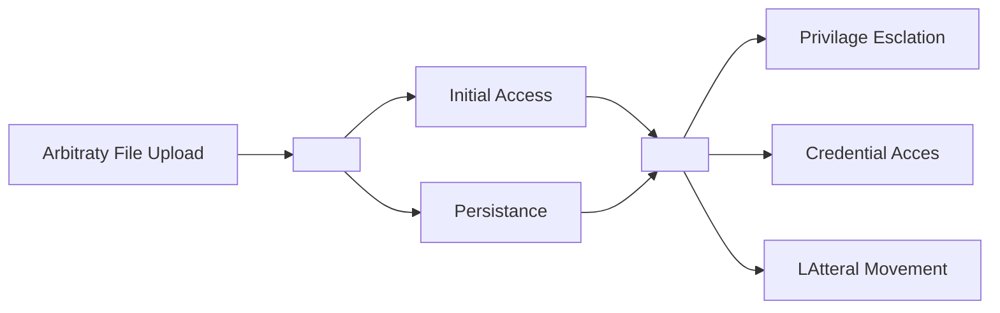
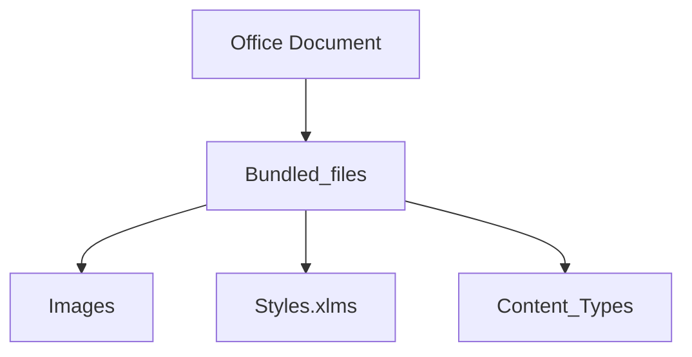

---

layout: post
title: CCN CERT 2024
date: November 26, 2024
tags: Conferencias
toc: true

---
# Román Ramírez - Frida 1, 2, 3

Que es DBI

- DBI o Dynamic Binary Instrumentatio en español se traduco como Instrumentacion Binaria DInámica
- Es una forma de analizar, examinar y manipular ejecutables sin modificarlos de manera que podemos cambiar su comportamiento y leer sus detalles, sin que el programa note la menor modificación.

Como (casi) todos los framwroks de DBI tiene un modelo cliente-servidor.

Frida usa Gum, → abre un interprete de javascript

### Los HOOKS

permite redirigir la ejecución de una función hacia nuestro propio código para, una vez realizado lo que queríamos, devolver el control a la función real.
/assets/images/posts/2024-11-26-CCN-CERT-2024/
Instalar Frida

---

# [Raúl Caro](https://jornadas.ccn-cert.cni.es/es/xviiijornadas-programa-general/xviii-jornadas-ccn-cert/ponente/raul-caro) - [**Implantes Web - ¡Conoce a tu enemigo y defiéndete!**](https://jornadas.ccn-cert.cni.es/es/xviiijornadas-programa-general/xviii-jornadas-ccn-cert/ponencia/implantes-web-conoce-a-tu-enemigo-y-defiendete)

1. Ahondar en el concepto Implante Web
2. Conocer tipos
3. Entender perspectiva ofensiva
4. Proponer estrategias de defensa y como protegernos

---

## Que son los Implantes Web

<aside>

Un implante web es una herramienta de postexolitacion que se utiliza bajo el contexto de un servicio web

</aside>

### WebShell

Ejecutar comando a nivel de sistema a través de la web. Por ejemplo con PHP

Tambien con JSP , y con ASP.NET, podemos ejecutar código.

El executor es el componente utilizado para la ejecución de código.

**Contramedidas generales**

- Restringir y auditar la subida de archivos
- Configurar los permisos de directorios
- Limitar privilegios a los usuarios de servicios web
- Monitorizar el despliegue de archivos sospechosos
- Migrar a nuevas tecnologías que dificultan su explotación: Frameworks modernos ya los incorporan.
- PHP: `disable_functions` (php.ini)
    
    No son configuraciones definitivas, existen muchos más caminos.
    
- JSP: definir directivas de bloqueo → en algunas aoplicaciones no son lo mejor pues no se configura correctamente. Con AppArmor si.
- [ASP.NET](http://ASP.NET): definir reglas de AppLocker para bloquear la ejecución (Windows) Ej: restinge la ejecución de binarios.
    
    

La web shell no esta limitada. PHP ya tiene funciones que hacen que hagamos cosas por ejemplo leer archivos.

CONTRAMEDIDAS:

### KRAKEN (php, jsp, ):

 

<aside>

Sigue el principio de: no ejecucion de comando del sistema.

- Se reimplementa comandos con las funciones nativas
</aside>

1. Reimplementaciíon nativa de comandos
2. Elevación de privilegios en diferentes ámbitos
    
    Xon kRAKEN cargamos una herramienta de explotacion que nos dará acceso a la cuenta en el contexto privilegiado sin la necesidad de la ejecucuión.-
    
3. Suplantacion de contextos de seguridad
    
    Con los proivilegios adecuados, poremos copiar el token del proceso de una identidad privilegiada, y podremos ejecutar a su nombre.
    
4. Ejecución de código no administrado: cargar funciones de la winappi u otras funcionalidades del sistema.

**Para cargar los módulos de Kraken**

El executor es el encargado de recibir ese codigo, interpretarlo, y darnos una respuesta:

| eval | ClassLoader | CSharpCodeProvider |
| --- | --- | --- |

### Conclusion

- Aplicar contramedidas generales
- Tiering Model y principio de nivel de privilegii
- Establecer medidas de detecciopn y montirorizacio n (EDR)
- Contenedores Docker, Distro-less envs, Hardenizacion
- Y sobretodo **Inventarios Activos**

Debemos dificultar lo suficiente el camino del atacante.

---

# [José Luis Sánchez Martínez](https://jornadas.ccn-cert.cni.es/es/xviiijornadas-programa-general/xviii-jornadas-ccn-cert/ponente/jose-luis-sanchez-martinez) - [**Más allá de lo evidente: Explorando el Threat Hunting Creativo**](https://jornadas.ccn-cert.cni.es/es/xviiijornadas-programa-general/xviii-jornadas-ccn-cert/ponencia/mas-alla-de-lo-evidente-explorando-el-threat-hunting-creativo)

## El arte del threat hunting

<aside>

Nuevas maneras practivas de detectar.

</aside>

### ¿Intera o Externa?

Donde queremos poner los esfuerzos para indentificar la vulnerabilidad

Splunk (PEAk) → proceso para el Thread Hunting. Aspectos importantes:

- Generar Hypotesis:
- Gather Date and Analyze: donde lo quiero hacer, en plataformas externas, o interno para identificar actividades en la red.

### H1: detección en las APT’s - detectar proactivamente …

Documentos ofimaticos → hunting maldocs

Todos los documentos tienen imagenes.

**¿Como identificar estos archivos de manera agil?**

## Images

### APT28

Viendo los hashes de las imagenes, vemos que se han ido subiendo / publicando a lo largo del tiempo.

Podíamos haberlas ifentificado, y una vez se suba un archivo a la plataforma, comprobará si están estas imagenes “fraudulentas”. 

### SIDEWINDER

La imagen en este caso, es una firma → dando veracidad al documento. Es probable que esta firma se puede seguir usando por lo que habría que tenerlo en cuenta.

## Styles.xml

Normalmente los agentes comparten style, sin embargo, hay alguno interesante porque dos empresas compartian el styles.xml.

Los 3 archivos tienen el mismo conten_type y styles lo que pueden haber sido generados por el mismo agente.

El Styles es mas personal

## [Content_type].xml

mucho mas comun al styles_xml

---

Aplicando la IA Generativa, para identificar cuando se suben documentos con imagenes de `alguien`.

---

## H2: detectar proactivamente archiovos PDF distribuidos por otro actor.

Se puede hacer de manera similar a los documentos ofimaticos.

AdobeAcrobarReader, hace una captura de pantalla de la primera pagina del PDF. Lo tienen configurado para que esa captura se suba como dropeado del PDF.

Esa captura, al subirla esta misma captura se encontraba en otros 6 documentos.

La SandBox cuando tiene un hipervinculo, siempre hace click. Se genera un archovo llamado Chrome_cache_entry.

Vemos que hay un monton de archivos PDF relacionados con ese javaScript que nos ha generado el navegador. BlindLinger??

## H3: detectar campañas de distribucion de malware a traves de correos electronicos

Los correos electronicos fraudulentos, contienn imagenes, de la universidad, banco etc. Las imagenes de las redes sociales, esos iconos, al subirlos al virus total, esta embedido en otros 33 correos iguales. Todos tienen el mismo tipo de contenido cambviando la universidad y el texto, pero las imagenes de las redes sociales son las mismas, por lo que podemos monitorear esta actividad.

---

# Antonio Manuel Martín - **The European Cyber Situational Awareness Platform (ECYSAP): a tool to understand the cyberspace and help conduct Cyber Ops**

ECYSAP

La OTAN está metida también de alguna manera porque a la hora de desarrollar la herramienta, se tienen en cuenta sus restricciones y requisito

Capabilities of the tool

- CIS Situation
- Counermeasures
- Mission Effects
- Wargaming
- Scenario Analysid
- Proyection
- Courses or Action

EU-GUARDIÁN → EUCINF → ECYSAP EYE

https://www.ecysap.eu/

Lo que ocurre en el ciberespacio se va a reforzar al igual con la guerra cognitiva.

Es el modelo quien elige la prioridad. 

En conclusion

---

# Miguel Espejel Corvera

 

https://www.traficom.fi/en/traficom-transport-and-communication-services-you

---

# Alvaro …& Maria Díaz Alba

## Ciberdelincuancia en telegram

- Drogras
- Armamento
- Credenciales

La API de telegram nos permite desarollar esta herramienta.

<aside>
Tenemos un grupo de telegram de exfiltrado de contraseñas.

</aside>

El bot, revisará estos archivos, comprobando conincidencias.

Al pasar un txt con un txt ficticio, este lo analizará y si encuentra coincidencias hará un “informe” el cual exportará a un .csv y lo reportará al usuario.

Maria: dos roles:

- Investigación de machinlearning
- Desarrollo de herramienta que mediante AI detexte la importancia de las contraseñas

En el momento que nos damos cuenta que hay muchas canales de este tipo, se decide idesarrollar la herramienta

### Predicción de riesgo

Se decide crear frupos de caracteristicas, resspecto al usuario, contraseña, archivo, grupo/canal y se les da un peso u otro. Ej: un alto cargo, tiene más puntuación que un usuario normal.

### Simulación de muestras.

- generamos 50 muestras
- se genera el archivo
- Se hace una predicción y se valora el riesgo

De momento en beta.

### Valor añadido

- Optimiza el trabajo del analista,
- estandariza el proceso de evaluación consistente y objetivo;
- y aumenta y mejora de precisión en informes y medidas de seguridad.

## Dashboard

Comparación automática (disminuir el trabajo al analista)

## Evolución

Ventajas

- Gratuita
- Existen otras herraminetas, que no monitorizan telegram.

Desventajas

- Principalmente defensiva
- Debilidades asociadas a la no presencia del analista en los gurpos de interes (privados o no conocidos)

---

# Antonio Sanz - 11 años luchando contra APT ¿qué hemos aprendido?

A los APT les encantan los correos 

El bastionado funciona

Los EDR funcionan bien

- Hace la vida difícil a los malos (binarios)
- Te da telemetría

Si tienes un incidente de un grupo APT, comunícate con medios fuera de banda

Si eres un objetivo solo tiene dos opciones: o estás dentro o aporreando la puerta 

---

# Enrique Pérez de Tena Martos

T4C → talent for cyber

